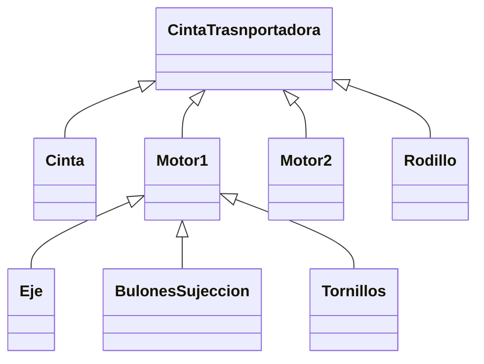

# Proyecto estudiantil ERP

## Modulo de maquinas

### Introducción

Proyecto de la asignatura de Sistemas Industriales de la carrera de ingeniería en sistemas de información.

El objetivo de esta es realizar un modulo de gestión  (CRUD) de maquinas en una organización industrial, que luego se acoplara con los módulos ya existentes para formar un sistema ERP completo.

Este modulo en concreto se centrara en la **Alta, Baja, Modificación y Lectura** de maquinas dentro de una planta industrial. Todo los otros elementos necesarios previos que haya que tener para concretar o testear el modulo, serán simulados (hardcodeados) en el programa (por ejemplo los códigos de ubicación geográfica de planta, el código de la planta y los códigos de ubicación de la maquina en la planta o proceso).

### Tareas

- [x] Definición de la línea o proceso de producción.
- [x] Definición de maquinas base.
- [x] Definición de maquinas secundarias.
- [ ] Definicion tecnica del modulo
  - [x] Elementos iniciales del modulo
  - [ ] Detalles de vista principal, previos al CRUD de las maquina
- [ ] X

### Definición de las tareas

Se describirá a grandes rasgos, sin detalles técnicos las tareas.

#### Definición de la línea o proceso de producción

La primera tarea a realizar será la definición de la línea o proceso de producción (este será nuestro punto de partida en el modulo).

~~~ mermaid
classDiagram
	Proceso <|-- Tarea1
	Proceso <|-- Tarea2
	Tarea1 <|-- Linea11
	Tarea1 <|-- Linea12
	Tarea2 <|-- Linea21
~~~

El código para la Línea 2 de la Tarea 1 del Proceso será una combinación del código del proceso, de la tarea 1 y el numero de línea, estas lineas son las ramificaciones que hay para realizar una misma tarea en paralelo. Por ejemplo: Proceso Llenado, Tarea Inyección, Línea 2 --> "LLEN-INY-2"

En nuestra aplicación se hardcodearan algunos de estos procesos con sus detalles para poder iniciar con lo que nos respecta a nuestro modulo.

-- Aclaración: los códigos dependerán de la normas y reglamentaciones de la empresa. --

#### Definición de maquina base

Definiremos a las maquinas base que serán el nodo principal de las maquinas que lo constituirán y que serán las que se ramificaran hasta llegar al elemento de maquina que es la unidad mínima de construcción de maquina.

La maquina base debe ser una maquina que realice una tarea especifica dentro de la línea, por ejemplo:

La cinta transportadora formada por la cinta, los motores, los ejes, etc. Una llenadora, puede estar conformada por inyector, sensor de nivel, y una maquina encargada de ubicar el envase dentro y fuera de la base de inyección (cinta transportadora pequeña, brazo robótico, etc.).

La cinta transportadora y la llenadora son maquinas base y sus códigos pueden ser "CINT" y "LLEN" respectivamente.

~~~ mermaid
classDiagram
	Linea1 <|-- Maquina1
	Linea1 <|-- Maquina2
	
	CintaTrasnportadora <|-- Cinta
	CintaTrasnportadora <|-- Motor1
	CintaTrasnportadora <|-- Motor2
	CintaTrasnportadora <|-- Rodillo
	
~~~

-- Aclaración: los códigos dependerán de la normas y reglamentaciones de la empresa. --

#### Definición de maquinas secundarias

Según lo explicado en la definición de maquinas base, las maquinas secundarias son las que componen a éstas y se van ramificando hasta llegar a la unidad mínima de construcción que es el elemento de máquina.

El motor de la cinta transportadora puede estar compuesto por los carbones, carcaza, eje, tornillos, tuercas, bulones de sujeción, etc.

La llenadora puede estar compuesto por el brazo robótico, el conjunto sensor de nivel, que a su vez lo componen tornillos, perfiles, el sensor, etc.

### Definición técnica

A medida que se vayan realizando las especificaciones técnicas, se ira avanzando en el desarrollo del modulo especificado en el archivo regitro.md. Las fechas indicaran cuando fueron escritas las definiciones. **Consultar siempre el documento de registro.**

#### Modulo

<u>Pantalla principal y datos precargados - 09/05/2020 - DD/MM/AAAA</u> 

Como nos centraremos en el CRUD de las maquinas, la pantalla inicial mostrara un árbol con elementos precargados. Estos elementos precargados serán las plantas, los procesos, la tarea y la línea en cada una de ella. Además poseerá otras pequeñas funcionalidades como mostrar el tipo de elemento y su código.

Si la tarea posee una sola línea, se representara como Línea 1 indiferentemente de que no posea otras, para mantener la estructura y el código y por si en un futuro se deben agregar otras líneas.

Cuando se seleccione una línea se habilitara la opción de inspeccionarla, abriendo una nueva ventana que llevara al CRUD de las maquinas. La opción de inspección solo estará habilitada para las líneas.

Cuando se decida inspeccionar una línea recién en ese momento se buscara de la base de datos la línea, las maquinas pertenecientes a esta y sus detalles para  no cargar todas las maquinas de todas las líneas y ahorrar tiempo y recursos. (No se si esto es lo mas optimo, pero por ahora se lo realizara así ya que desconozco la realidad del ámbito empresarial en este aspecto, es decir, en la cantidad de consultas, las verdaderas necesidades o requisitos de los usuarios).

#### Clase Maquina

La clase maquina poseerá como claves:

* El código de la maquina para diferenciarla de otros tipos de maquinas.
* El código del padre, es decir del elemento o maquina inmediatamente superior a la que ésta compone.
* El código de la línea, para poder diferenciarlas de maquinas similares en otras líneas y además ayudara a la búsqueda en la DB.

El código del padre es igual al código de la línea en caso de las maquinas inmediatamente debajo de ésta.

